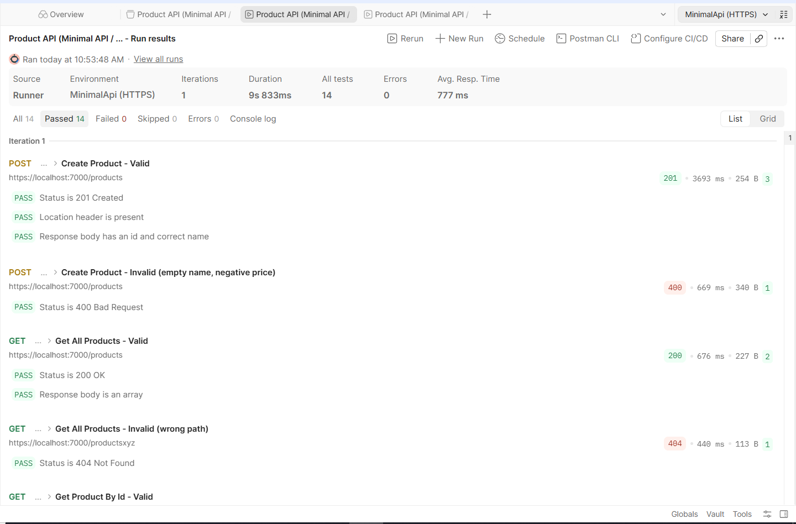
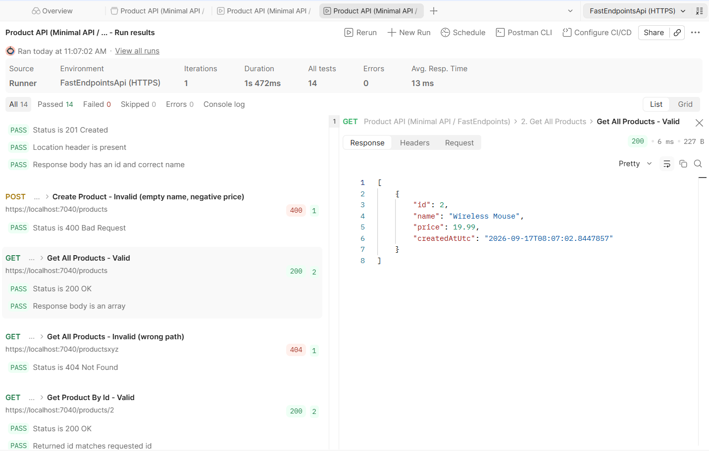

# ASP.NET Core Research Assignment — Configuration, Logging & API Styles

Two ASP.NET Core 10 Web APIs implementing the same Product CRUD behavior — one as a
Minimal API, one with FastEndpoints — plus the research write-up, HTTPS setup, and
Postman evidence the assignment asks for.

## Overview

- [`src/MinimalApi`](src/MinimalApi) — Product CRUD using ASP.NET Core Minimal APIs.
- [`src/FastEndpointsApi`](src/FastEndpointsApi) — the same Product CRUD using
  FastEndpoints, same routes and status codes (see the equivalence table below).
- [`docs/research-answers.md`](docs/research-answers.md) — Parts 1–5 and 8 research
  answers, sourced from official Microsoft/Serilog docs.
- [`docs/comparison-table.md`](docs/comparison-table.md) — Part 7 comparison questions,
  table, and final recommendation.
- [`postman/`](postman) — one Postman collection (all 5 Product operations, valid +
  invalid examples) and two environments (one per project, HTTPS `baseUrl`).
- [`docs/postman-evidence/`](docs/postman-evidence) — screenshots proving the same
  collection passed 14/14 against both projects (see "Postman Evidence" below).

Both projects: .NET 10, EF Core with the SQL Server provider, User Secrets for the local
connection string, Serilog (console + rolling file sink, request logging), explicit
Kestrel HTTP/HTTPS endpoints, and **no Swagger/OpenAPI anywhere** — see Compliance
Evidence below.

## How to run

For each project (`src/MinimalApi` or `src/FastEndpointsApi`):

1. Set your local SQL Server connection string in User Secrets (never commit it):
   ```bash
   cd src/MinimalApi
   dotnet user-secrets set "ConnectionStrings:DefaultConnection" "Server=localhost;Database=MinimalApiDb;Trusted_Connection=True;TrustServerCertificate=True;"
   ```
   ```bash
   cd src/FastEndpointsApi
   dotnet user-secrets set "ConnectionStrings:DefaultConnection" "Server=localhost;Database=FastEndpointsApiDb;Trusted_Connection=True;TrustServerCertificate=True;"
   ```
   > The database name here must match the placeholder connection string in that
   > project's `Data/AppDbContextFactory.cs` — that factory (not your User Secret) is
   > what `dotnet ef database update` actually targets. If you use a different database
   > name in your User Secret, apply the migration against that name explicitly instead:
   > `dotnet ef database update --connection "<your actual connection string>"`.
2. Apply the migration:
   ```bash
   dotnet ef database update
   ```
3. Trust the local HTTPS development certificate, if you haven't already:
   ```bash
   dotnet dev-certs https --trust
   ```
4. Run it:
   ```bash
   dotnet run --launch-profile https
   ```
   MinimalApi listens on `https://localhost:7000` / `http://localhost:5157`.
   FastEndpointsApi listens on `https://localhost:7040` / `http://localhost:5065`.
5. Import [`postman/Product.postman_collection.json`](postman/Product.postman_collection.json)
   plus the matching environment file for the project you're testing, and run the
   requests from Postman.

## DI lifetime justification

`AppDbContext` is registered **Scoped** (the `AddDbContext` default) — one instance per
HTTP request, matching EF Core's unit-of-work model, so change tracking and
`SaveChangesAsync` stay consistent within a single request.

`ProductService` (and `IProductService`) is registered **Scoped** to match. Registering
it as **Singleton** would create a **captive dependency**: a singleton holds onto its
first-injected `AppDbContext` for the lifetime of the app, long after that context's
request has ended, leading to either an `ObjectDisposedException` or, worse, silently
shared/stale state across unrelated requests. **Transient** would avoid the captive
dependency but creates a new `ProductService` per injection for no benefit here, since
nothing about it needs to be recreated more than once per request. Scoped is the
correct match for a service whose only dependency is a scoped `DbContext`.

## AsNoTracking justification

`GetAllAsync` and `GetByIdAsync` in `ProductService` use `.AsNoTracking()`. Both are
pure reads — the returned data is projected into a DTO and sent back to the client, never
mutated or passed to `SaveChangesAsync` — so EF Core's change tracker has nothing to do
for them. Skipping change tracking avoids the snapshot/comparison overhead per entity,
which is pure cost with no benefit on a read-only path. `CreateAsync`, `UpdateAsync`, and
`DeleteAsync` don't use it, because those genuinely need tracked entities to call
`Add`, mutate properties, or `Remove` before `SaveChangesAsync`.

## Postman Evidence

The exact same Postman collection — [`postman/Product.postman_collection.json`](postman/Product.postman_collection.json),
unmodified — was run against both projects over HTTPS, switching only the
environment (`MinimalApi (HTTPS)` / `FastEndpointsApi (HTTPS)`). All 14 assertions
(5 operations, valid + invalid, status codes, headers, and body shape) passed on
both, with zero failures:


*MinimalApi, `https://localhost:7000`*


*FastEndpointsApi, `https://localhost:7040`*

This is the evidence for Part 7's requirement to verify both implementations expose
equivalent routes and behavior: one collection, no per-project request changes, same
pass result against both. It is not a performance comparison — response times shown in
the run include cold start and aren't a meaningful benchmark, consistent with the
assignment's instruction not to base any conclusion on performance alone (see the
[comparison table](docs/comparison-table.md)).

## Compliance Evidence

No Swagger/OpenAPI package or middleware anywhere in the repo:

```
$ git grep -i "swagger"
(no matches)
```

No plaintext credential committed to any tracked file. The single hit below is an
illustrative example string inside the research write-up (`User Id=...;Password=...`),
explaining what a *credentialed* connection string looks like — not a real secret:

```
$ git grep -iE "password=|pwd="
docs/research-answers.md:`User Id=...;Password=...` explicitly — must be treated as a full secret, because it
```

No commit in the project's history ever introduced a real `Password=` value — the only
match across the whole history is that same documentation line, added in the Stage 1
commit:

```
$ git log -S "Password=" --all --oneline
8dc2243 Stage 1: research answers for Parts 1-5 and 8 (Arabic prose, official MS/Serilog sources)
```

Connection strings are never written to any tracked file — both projects read
`ConnectionStrings:DefaultConnection` from User Secrets in Development (see "How to
run" above); `appsettings.json` and `appsettings.Development.json` in both projects
contain no `ConnectionStrings` section at all.
